# venus-docker-grafana - Advanced Victron Dashboarding

Venus-docker-grafana is a dashboarding solution for Victron Energy systems.
Its a niche alternative to our main solution, the [VRM Portal](https://vrm.victronenergy.com).

Compared to VRM, the docker grafana solution is:

- more work to install & configure
- not officially supported.

But also offers:

- more granular data, its recorded at a (approx) two second interval
- an offline solution: venus-docker-grafana can run on a computer local to a Victron system. No internet required.
- far more options in graphing, visualisation and customisation.

This solution can work with one or more GX Devices in your local network, as well connect
to devices via the VRM cloud.

Note that "Grafana" is not a Victron product. Its an existing widely used dashboarding solution.
Make sure to go online and learn more about it.

An example of a dashboard:

Instruction video how to use and configure the dashboards, once installed:

## 1. Requirements

- A Victron Energy system including a [Victron GX Device](https://www.victronenergy.com/live/venus-os:start)
- A computer to host and run all this. It can be a Windows or Apple laptop or
computer. But also a raspberrypi: Running this solution can be done on any platform that support Docker.
- Or, rather than hosting it locally, it can also be hosted on Amazon AWS and other cloud
providers. See the [AWS instructions](AWS.md).
- Patience and willingness to study and figure all this out. Beware that thos is not an officially supported
Victron solution. Our partners, dealers and neither ourselves will help you in case of problems. For support,
[go to Community and search for Grafana](https://community.victronenergy.com/search.html?c=&includeChildren=&f=&type=question+OR+idea+OR+kbentry+OR+answer+OR+topic+OR+user&redirect=search%2Fsearch&sort=relevance&q=grafana).
The main item in this repository is a docker-compose file that ties together all thats needed to store &
visualise the data. from a at ~2 second interval and analyse it using
[Grafana](https://grafana.com/). Grafana is a super powerful webbased data analysis tool.
Which is quite easy to learn.

This repository contains the docker compose configurations and is all that is needed to get up and running. The
source code and setup for the docker images are located here: https://github.com/victronenergy/venus-docker-grafana-images 

For the latest info on changes we
are making to the solution, see: https://github.com/victronenergy/venus-docker-grafana-images/releases

## 2. How to install

### 2.1 Host it locally

This video walks through below steps, click to start:

1. Download and install [Docker desktop](https://www.docker.com/products/docker-desktop). Its available for
Windows, macOS, Linux and more operating systems. Notes:
    - Windows 10 Home could be problematic because
Docker needs features currently only available in Windows 10 professional. There are work arounds, search on
Google for docker windows 10 home to find more information. This is not specific to Victron Energy.
    - Om Windows Prof., and probably other platforms too, Docker Desktop runs in the background and nothing
    will appear on the screen, Click on Show hidden items, click on the Docker icon and then Dashboard.
    - Wait until Docker is running - the icon in the bottom left says 'running'
1. Enable the MQTT service on your GX Device in Settings -> Services.
2. Download the docker compose [file](https://raw.githubusercontent.com/victronenergy/venus-docker-grafana/master/docker-compose.yaml) (right-click and use Save as)
3. In the directory containing the downloaded file, execute `docker-compose up --detach`. Notes:
    - To do this on Windows, use the Power shell for this. For a detailed walkthrough, see above
      video.
    - The installation process takes a quite a few minutes. Check it completes without errors.
4. Go to the admin interface @ http://localhost:8088, default username and password are admin and admin.
4. Follow instructions for option A, B OR C below
5. Accessing Grafana on http://localhost:3000 and enter `admin` for user name and `admin` for password.

#### Option A) Automatic discovery - works for devices in local network

Go to Configuraton -> Local Discovery and turn `Enabled` on and click `Save`

UPnP discovery will automatically find and start datalogging for all GX devices running
v2.30~35 or later.

#### Option B) Manual configuration for devices in a local network

Go to Configuration -> Manual and turn on `Enabled`

Click `Add` and enter the IP address or hostname for each device you want to use.

Clisk `Save` to start collecting data

#### Option C) Setup To Use VRM MQTT

With this setup, you can run the system on any machine that has access to the internet, you do not
need to have local access to your GX devices.

If you have two factor authentication enabled on VRM, please turn it off.

Go to Configuration -> VRM and turn on `Enabled`

Enter your VRM username and password and click `Login`.

All your devices in VRM will show in the list.

Clisk `Save` to start collecting data

### 2.2 Host in on Amazon AWS or another cloud provider.

See the [AWS instructions](AWS.md).

## 3. Influxdb Retention Policy

The default retention policy is 30 days. To change this you can go to Configuration -> InfluxDB In the admin interface.
The value is an influxdb [Duration](https://docs.influxdata.com/influxdb/v1.7/query_language/spec/#durations)

## 4. Setting up a Grafana Dashboard

For an introductory overview refer to the [Getting started with Victron and Grafana Part 2 - Setting up a dashboard](https://youtu.be/B-sGH0etieM) instructional video.

### 4.1 Creating a new panel/visualisation
To create a new query and dashboard panel/visualisation it’s possible to start with a new/blank query or to duplicate
an existing query/panel and then modify it to suit.

To create a new query, click on the ‘Add panel’ button in the top right of the screen.

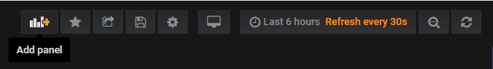

Then select ‘Add Query’ or ‘Choose Visualization’ – either will work as they can be easily switched between during the
configuration.

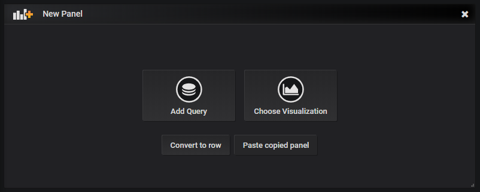

A new/blank Queries page shown below;

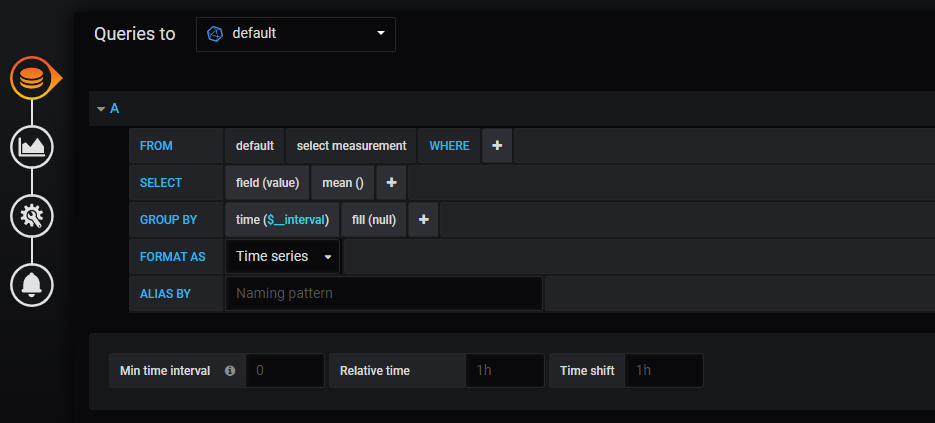

To duplicate an existing query/panel click on the dropdown next to the panel name, then hover over ‘More’ and select ‘Duplicate’. 

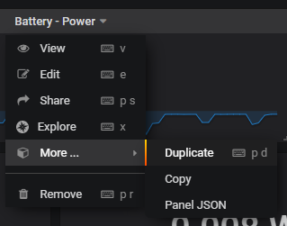

Once a new panel is created, click on the dropdown next to the panel name, and then select ‘Edit’ to open the Queries page.

Dashboard setup and configuration is completed within the ‘Queries’, ‘Visualization’ and ‘General’ settings pages, as
described in the following sections.

### 4.2 Queries
All available Venus OS parameters/measurements are stored in InfluxDB using modified MQTT topics – with the Portal ID and
instance number removed from the MQTT path and available as an independent filter "tag". The installation name (if available)
is another useful filter “tag” available.

Every accessible parameter/measurement in the Venus OS has an associated dbus path which can be searched for in Grafana
and selected as the data source to monitor/display.

The first section of the path refers to the dbus service name (the data source/device) and the remainder is the rest of
the string is the dbus object path.

Some Venus OS dbus path examples are;
- battery/Dc/0/Voltage
-	solarcharger/State
-	vebus/Ac/Out/L1/P
-	system/Relay/0/State

The main configuration of each dashboard visualisation/panel is performed within the Queries page, which has multiple
fields to query for the specific data required and options related to the data interpretation and presentation.

A brief explanation of each section is provided below.

#### Queries - FROM
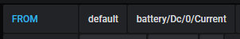

A) The database to query - normally select 'default' (or as shown in the 'Queries to' dropdown above).

B) The dbus path - search for and select the desired parameter.

The required dbus path for the parameter/measurement can be typed in directly (if the exact path is known) or easily
searched for and selected directly in Grafana.

Since the complete list of dbus path is extensive, particularly if the required dbus arrangement is not well known it’s
best to search for the dbus service name (all in lower case) and then scroll through the list to find the required
parameter/measurement.

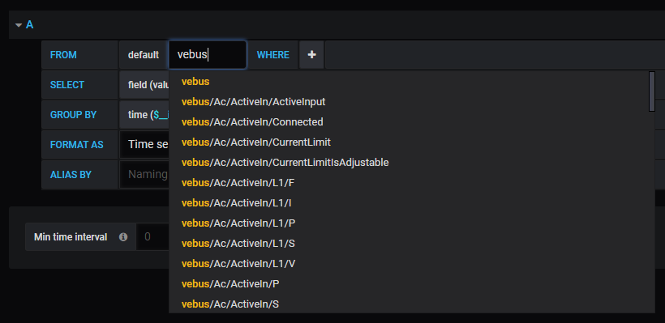

Unfortuantly Grafana currently has a limitation where the inbuilt search function is limited to a maximum of 100 search
results, meaning that for some dbus services with over 100 paths (such as ‘settings’ and ‘vebus’), not all available paths
will be shown in the list and further filtering may be required. A
[GitHub issue](https://github.com/victronenergy/venus-docker-grafana/issues/8)
has recently been created to increase the search limit to 250 lines in order to avoid this situation.

The common dbus service names are;
-	battery
-	charger
-	digital input
-	generator
-	genset
-	gps
-	grid
-	inverter
-	meteo
-	pump
-	pvinverter
-	settings
-	solarcharger
-	system
-	tank
-	temperature
-	vebus

The other effective option is to search directly for the desired parameter/measurement using a single word with a capital
first letter (as the search is case sensitive and all sub-paths use a capital first letter for each word).

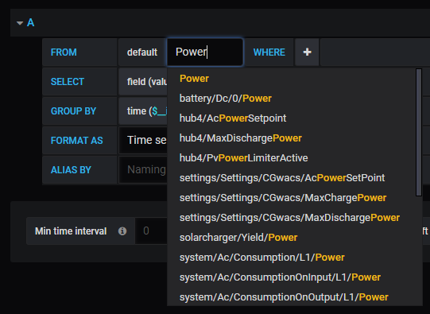

Note that for the search feature to work there must not be an 'instanceNumber' WHERE condition, if one exists it needs
to be removed and re-added later.

To better familiarise yourself with the Venus OS dbus path structure refer to the [dbus path list](https://github.com/victronenergy/venus/wiki/dbus) in GitHub or the [modbus TCP register list](https://www.victronenergy.com/support-and-downloads/whitepapers) in the whitepapers section of the Victron website.

#### Queries - WHERE

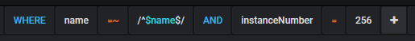

This is the section the filter tags are added to ensure that the data is queried from the correct installation and also
the correct device in the installation.

Particularly when there are multiple installations linked to the same Grafana instance and/or with larger systems
(that have multiple devices of the same kind) it is vital to set this section up correctly to ensure that the data
displayed is accurate and not coming from multiple sources (as a combined total) or an unintended source.

A) Add either a ‘portalId’ or ‘name’ tag to define the installation to query – then select/enter the desired portal ID or
installation name to query for data.

The installation ‘name’ tag is most versatile as it’s possible to specify a dynamic name with '=~ /^$name$/' - this
automatically ensures that the data comes from the 'name' of the installation selected at the top left of the dashboard,
enabling the same dashboard to monitor multiple sites without the need for any further updates.

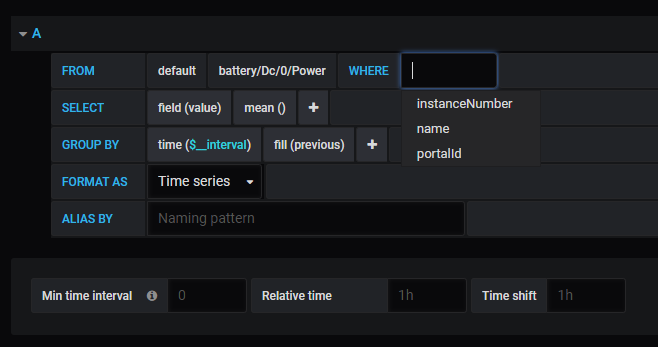

B) Add the ‘instanceNumber’ filter tag where appropriate – then select/enter the desired device instance' number to query for data.

This filter tag is vital when multiple devices of the same kind exist in the system to avoid confusion between data from multiple
devices that share the same dbus paths. 

To identify the correct number for a particualr device, use the GX device to check for the device instance number under
'Device List'>'XYZ device'>'Device Instance'.

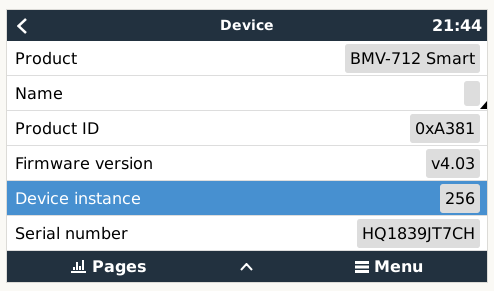

#### Queries - SELECT

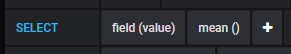

A) The data type - Retain the default settings of 'field(value)'.

B) The data usage/interpretation – normally select 'mean()' (in the Aggregations menu) which provides a short term data average
or ‘last ()’ (in the Selectors menu) to simply use the last known value.

#### Queries - GROUP BY

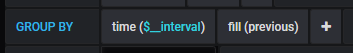

A) The time interval to group individual data points - normally select '$__interval' to display data at full resolution or if
desired (such as to smooth fluctuating data) an alternative time interval can be selected to group individual data points
and present a combined value.

B) The data interpretation between individual data points – normally select 'fill(previous)' to display the last value between
data points/eliminate gaps in the data or for some measurements 'fill(linear)' may be preferred which plots a linear line
between data points/gaps between data.
For data plots it is essential to provide a fill direction other than fill(null) to eliminate gaps between data points.

Example with fill(null) between data points;

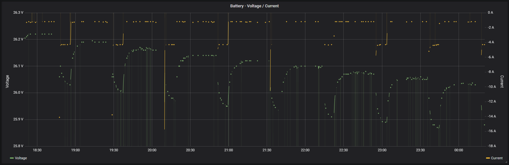

Example with fill(linear) between data points;

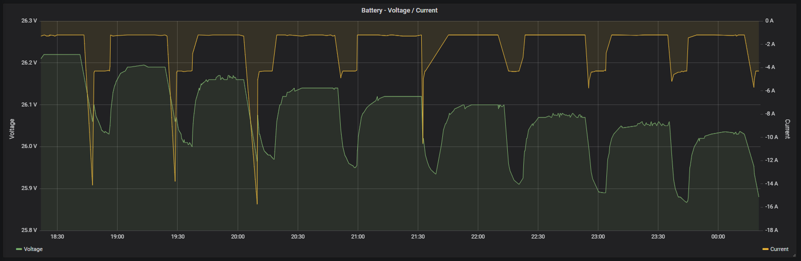

This is an example of a completed Queries page where two different (but related) dbus paths are displayed in a single graph;

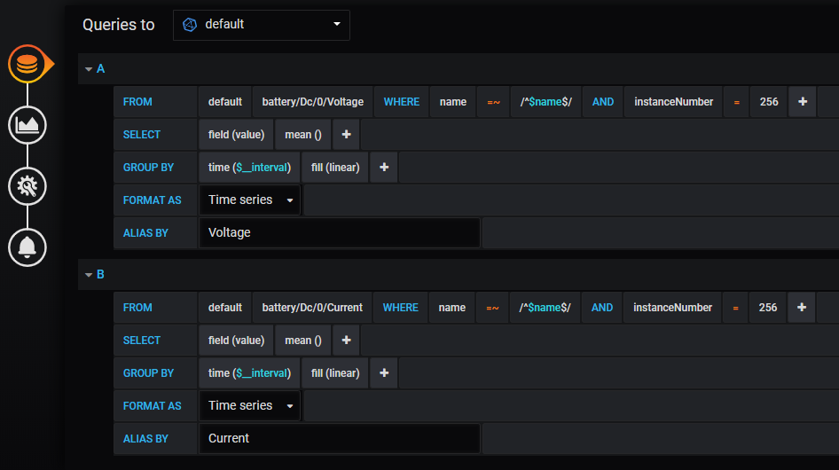

### 4.3 Visualization
To select or change the type of panel/visualization, enter the Visualization page and then click on the Visualization dropdown
to reveal all the available options. 

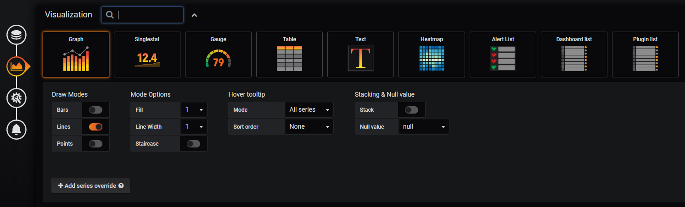

Further configuration of the panel/visualization selected is also completed from the Visualization and there are extensive
customisation options available.
This is an example of a completed Visualization page where two different (but related) dbus paths are displayed in a single
graph (each on a different axis);

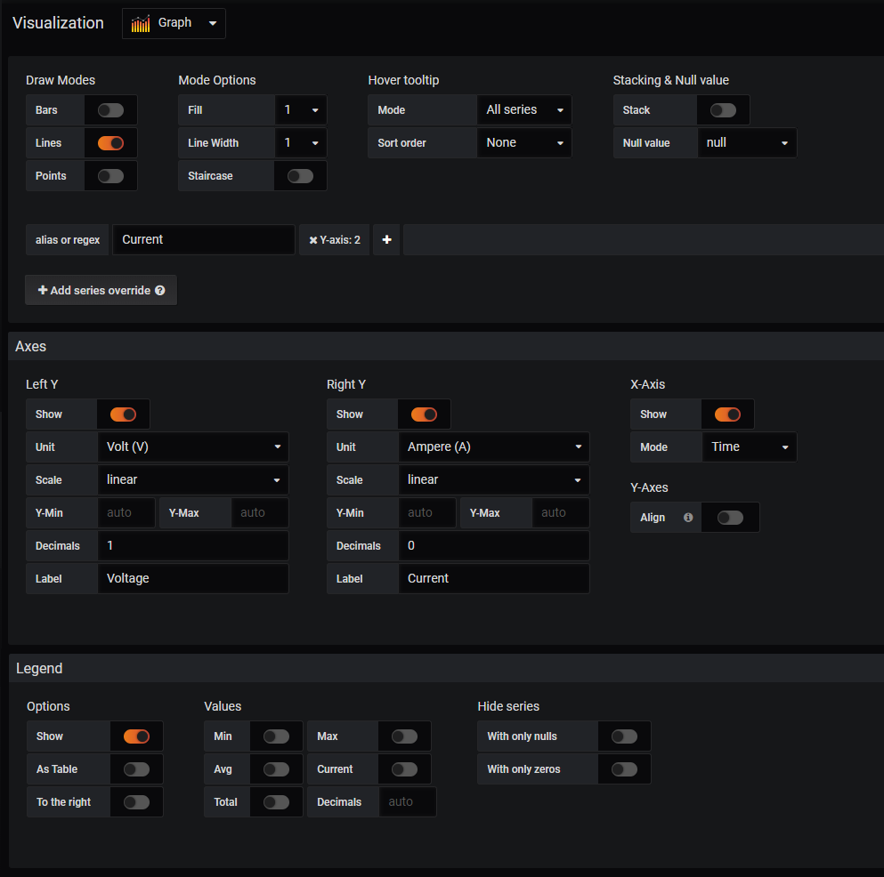

### 4.4 General
The title of the panel/visualisation is entered in the general page.

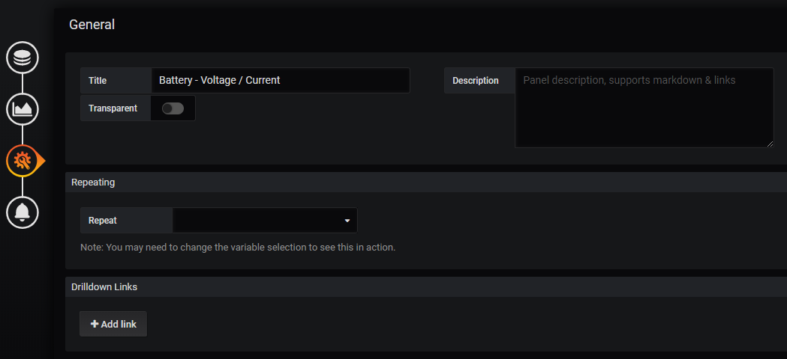

## 5. Internal workings

Docker is a container technology, see Google.

The data is retrieved using the
[MQTT protocol](https://github.com/victronenergy/dbus-mqtt).

[The server](https://github.com/victronenergy/venus-docker-grafana-images/tree/master/server)
contains the Node JS code that takes care of the MQTT communication and storing the data in
the Influx database.

This repo only contains the docker-compose file. The rest of the sources, there is only a handful, is in
[venus-docker-grafana-images](https://github.com/victronenergy/venus-docker-grafana-images).
